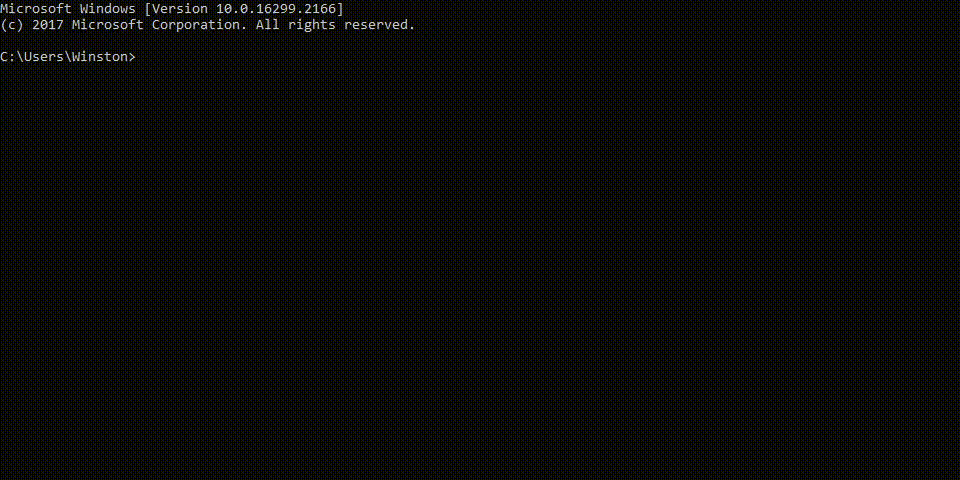
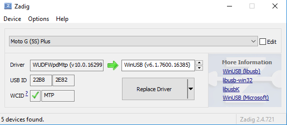

# Using `MTP tools` in Windows

## Replace MTP driver by WinUSB driver
- Download [Zadig](https://zadig.akeo.ie/)
- Open **Zadig** and select **Options &rarr; List All Devices**.
- Select your Mobile phone from list of devices and install **WinUSB (v6.1.7600.xxxxx)** driver by clicking **Replace Driver**

---

## Usage

Download and extract precompiled binaries of [MTP tools](https://github.com/jabezwinston/mtp-tools/releases/download/v1.1.19/mtp-tools_v1.1.19_win32.zip) for Windows

|         Operation        |   Command                                                   |
|--------------------------|:------------------------------------------------------------|
| Device check             | `mtp-detect`                                                |
| List files               | `mtp-filetree`                                              |
|                          | `mtp-files`                                                 |
| Copy file from device    | `mtp-getfile  <fileid> <dest_filepath>`                     |
|                          | `mtp-connect --getfile <src_filename> <dest_filepath>`      |
| Copy file into device    | `mtp-sendfile <src_filepath> <dest_filename>`               |
|                          | `mtp-connect --sendfile <src_filepath> <dest_filename>`     |
| Delete file in device    | `mtp-delfile -n <file_id>`                                  |
|                          | `mtp-delfile -f <filename>`                                 |
|                          | `mtp-connect --delete <filename>`                           |
| Create folder            | `mtp-newfolder <foldername> 0 <storage_id>`                 |
|                          | `mtp-connect --newfolder <foldername>`                      |
| Create sub-folder        | `mtp-newfolder <foldername> <parentfolder_id> <storage_id>` |
| Format device            | `mtp-format`                                                |

## Other docs

- Detailed information can be found in [DETAILED_USAGE.md](DETAILED_USAGE.md)

- Instruction on compiling `mtp-tools` from source code are available in [COMPILING.md](COMPILING.md)